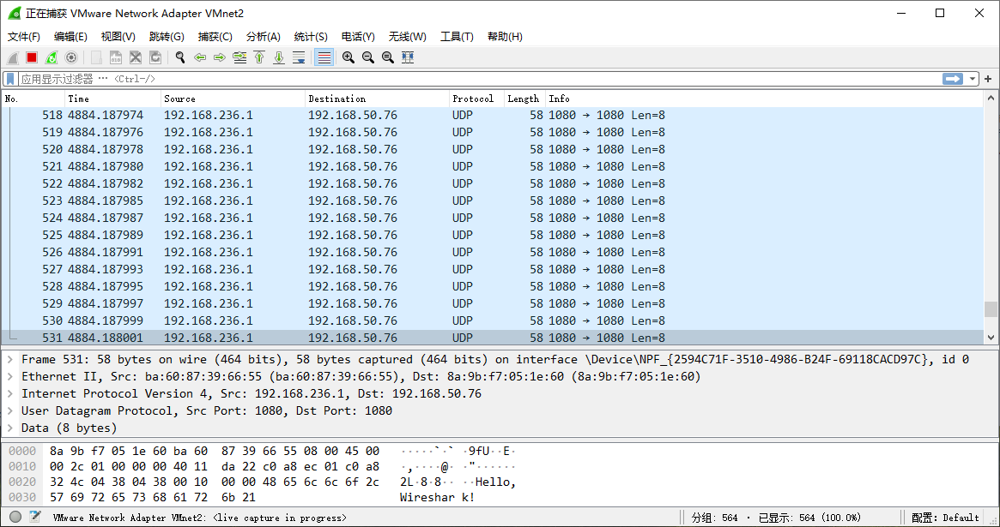

# Send and receive packets with DPDK

## Part 0 Set up environment

基础环境：~~Ubuntu 18.04 LTS~~降级DPDK后各种报错又把Ubuntu 16.04 LTS装回来了

安装依赖：

```shell
$ sudo apt install libpcap-dev
```

~~下载DPDK，我选了目前LTS分支的最新版本19\.11，~~根据TA的要求更换为指定版本16\.11\.11，解压后执行：

```shell
 $ make config T=x86_64-native-linuxapp-gcc
 $ sed -ri 's,(PMD_PCAP=).*,\1y,' build/.config
 $ make
```

经过漫长的等待编译完毕，然后配置DPDK的运行环境，以root用户运行：

```shell
$ mkdir -p /mnt/huge
$ mount -t hugetlbfs nodev /mnt/huge
$ echo 64 > /sys/devices/system/node/node0/hugepages/hugepages-2048kB/nr_hugepages
$ modprobe uio
$ insmod ./build/kmod/igb_uio.ko
$ ./tools/dpdk-devbind.py -s
$ ./tools/dpdk-devbind.py --bind=igb_uio 02:00.0
$ export RTE_SDK=/home/richard/Desktop/dpdk
$ export RTE_TARGET=build
```

绑定网卡那一步会报警告可以无视无伤大雅，然后测试一下DPDK是否成功安装：

```shell
$ cd $RTE_SDK/examples/helloworld
$ make
$ ./build/helloworld
```

得到输出：

```shell
...
hello from core 1
hello from core 2
hello from core 3
hello from core 0
```

## Part 1 Get familiar with DPDK

Q1: What’s the purpose of using hugepage?

* 在内存容量不变的条件下，页越大，页表项越少，页表占用的内存越少。更少的页表项意味着缺页的情况更不容易发生，缺页中断的次数会减少，TLB的miss次数也会减少。

Q2: Take examples/helloworld as an example, describe the execution flow of DPDK programs?

* 初始化Environment Abstraction Layer \(EAL\)，在main\(\)函数中：

  ```c++
  ret = rte_eal_init(argc, argv);
  if (ret < 0)
  	rte_panic("Cannot init EAL\n");
  ```

  在Linux环境下该调用在main\(\)被调用前完成初始化流程（每个lcore的初始化等），返回的是参数的个数。

* 在从属核心上调用lcore\_hello\(\)：

  ```c++
  RTE_LCORE_FOREACH_SLAVE(lcore_id) {
  	rte_eal_remote_launch(lcore_hello, NULL, lcore_id);
  }
  ```

* 在主核心上调用lcore\_hello\(\)：

  ```c++
  lcore_hello(NULL);
  ```

* 最后等待所有线程执行结束：

  ```c++
  rte_eal_mp_wait_lcore();
  ```

Q3: Read the codes of examples/skeleton, describe DPDK APIs related to sending and receiving packets\.

* rte\_eth\_tx\_burst\(\)，定义如下：

  ```c++
  static uint16_t rte_eth_tx_burst (
      uint16_t port_id,
      uint16_t queue_id,
      struct rte_mbuf ** tx_pkts,
      uint16_t nb_pkts
  )
  ```

  用于在参数port\_id指定的以太网设备上发送参数queue\_id指定的输出队列上的数据包，参数nb\_pkts指定了要发送的数据包的数量，这些数据包由rte\_mbuf结构的参数tx\_pkts提供，函数返回实际发送的包的数量。

* rte\_eth\_rx\_burst\(\)，定义如下：

  ```c++
  static uint16_t rte_eth_rx_burst (
      uint16_t port_id,
      uint16_t queue_id,
      struct rte_mbuf ** rx_pkts,
      const uint16_t nb_pkts
  )	
  ```

  用于在参数port\_id指定的以太网设备上的由参数queue\_id指定的接收队列上循环解析RX ring，最多nb\_pkts个包，并且对于每一个完整的RX descriptor，初始化一个rte\_mbuf结构的数据，并存放到参数tx\_pkts的下一个目录。

Q4: Describe the data structure of ‘rte\_mbuf’\.

* 在rte\_mbuf\_core\.h的第467行找到其定义如下：

  ```c++
  struct rte_mbuf {
      RTE_MARKER cacheline0;
  
      void *buf_addr;           
      RTE_STD_C11
      union {
          rte_iova_t buf_iova;
          rte_iova_t buf_physaddr; 
      } __rte_aligned(sizeof(rte_iova_t));
  
      /* next 8 bytes are initialised on RX descriptor rearm */
      RTE_MARKER64 rearm_data;
      uint16_t data_off;
  
      RTE_STD_C11
      union {
          rte_atomic16_t refcnt_atomic; 
          uint16_t refcnt;
      };
      uint16_t nb_segs;         
      uint16_t port;
  
      uint64_t ol_flags;        
      /* remaining bytes are set on RX when pulling packet from descriptor */
      RTE_MARKER rx_descriptor_fields1;
  
      /*
       * The packet type, which is the combination of outer/inner L2, L3, L4
       * and tunnel types. The packet_type is about data really present in the
       * mbuf. Example: if vlan stripping is enabled, a received vlan packet
       * would have RTE_PTYPE_L2_ETHER and not RTE_PTYPE_L2_VLAN because the
       * vlan is stripped from the data.
       */
      RTE_STD_C11
      union {
          uint32_t packet_type; 
          struct {
              uint32_t l2_type:4; 
              uint32_t l3_type:4; 
              uint32_t l4_type:4; 
              uint32_t tun_type:4; 
              RTE_STD_C11
              union {
                  uint8_t inner_esp_next_proto;
                  __extension__
                  struct {
                      uint8_t inner_l2_type:4;
                      uint8_t inner_l3_type:4;
                  };
              };
              uint32_t inner_l4_type:4; 
          };
      };
  
      uint32_t pkt_len;         
      uint16_t data_len;        
      uint16_t vlan_tci;
  
      RTE_STD_C11
      union {
          union {
              uint32_t rss;     
              struct {
                  union {
                      struct {
                          uint16_t hash;
                          uint16_t id;
                      };
                      uint32_t lo;
                  };
                  uint32_t hi;
              } fdir; 
              struct rte_mbuf_sched sched;
              struct {
                  uint32_t reserved1;
                  uint16_t reserved2;
                  uint16_t txq;
              } txadapter; 
              uint32_t usr;
          } hash;                   
      };
  
      uint16_t vlan_tci_outer;
  
      uint16_t buf_len;         
      uint64_t timestamp;
  
      /* second cache line - fields only used in slow path or on TX */
      RTE_MARKER cacheline1 __rte_cache_min_aligned;
  
      RTE_STD_C11
      union {
          void *userdata;   
          uint64_t udata64; 
      };
  
      struct rte_mempool *pool; 
      struct rte_mbuf *next;    
      /* fields to support TX offloads */
      RTE_STD_C11
      union {
          uint64_t tx_offload;       
          __extension__
          struct {
              uint64_t l2_len:RTE_MBUF_L2_LEN_BITS;
              uint64_t l3_len:RTE_MBUF_L3_LEN_BITS;
              uint64_t l4_len:RTE_MBUF_L4_LEN_BITS;
              uint64_t tso_segsz:RTE_MBUF_TSO_SEGSZ_BITS;
              /*
               * Fields for Tx offloading of tunnels.
               * These are undefined for packets which don't request
               * any tunnel offloads (outer IP or UDP checksum,
               * tunnel TSO).
               *
               * PMDs should not use these fields unconditionally
               * when calculating offsets.
               *
               * Applications are expected to set appropriate tunnel
               * offload flags when they fill in these fields.
               */
              uint64_t outer_l3_len:RTE_MBUF_OUTL3_LEN_BITS;
              uint64_t outer_l2_len:RTE_MBUF_OUTL2_LEN_BITS;
              /* uint64_t unused:RTE_MBUF_TXOFLD_UNUSED_BITS; */
          };
      };
  
      uint16_t priv_size;
  
      uint16_t timesync;
  
      uint32_t seqn;
  
      struct rte_mbuf_ext_shared_info *shinfo;
  
      uint64_t dynfield1[2]; 
  } __rte_cache_aligned;
  ```

  * buf\_addr: 当前mbuf的虚拟地址
  * union \{\.\.\.\}: mbuf对应的物理地址
  * data\_off: 标识mbuf的data room开始地址到报文起始位置的偏移
  *  refcnt: mbuf被引用的次数
  * nb\_segs, next: 当前的mbuf报文有多少个分段和下一个分段的地址，单向链表连接
  * port: 输入输出端口号
  * ol_flags: 卸载特性标识
  * packet_type: 报文类型
  * pkt\_len, data\_len, buf\_len: 报文长度信息
  * vlan\_tci, vlan\_tci\_outer: vlan信息
  * union \{\.\.\.\}: 报文的hash信息
  * timestamp: 时间戳，只有ol\_flags设置了PKT\_RX\_TIMESTAMP才有意义
  * pool: mbuf从这个pool申请来的，释放mbuf的时候用到
  * union \{\.\.\.\}: tx offload的信息

## Part 2 Send packets with DPDK

1. **Construct UDP packets**

   | 最外面    | 第二外面 | 里面    | 最里面 |
   | --------- | -------- | ------- | ------ |
   | ETHER_HDR | IPV4_HDR | UDP_HDR | DATA   |

   由于markdown表格必须两行无奈加上了奇怪的第一行，定义如下：

   ```c++
   struct Packet {
   	struct rte_ether_hdr ether_hdr;
   	struct rte_ipv4_hdr ipv4_hdr;
   	struct rte_udp_hdr udp_hdr;
   	struct rte_data data;
   };
   ```

   其中数据部分定义如下：

   ```c++
   struct rte_data {
   	char content[16];
   };
   ```

2. **Write a DPDK application to construct and send UDP packets**

   ~~**配置Virtual NIC之前一定要先确保ifconfig可用，配置完成后会断网没法下载安装！**~~降级后无此问题

   具体代码参见main\.c文件，发包的内容为“Hello,Wireshark!”。

3. **Verify the correctness**

   用Wireshark捕获到包的内容如下：

   