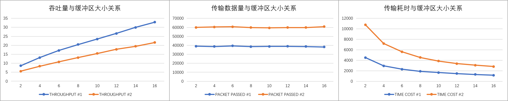
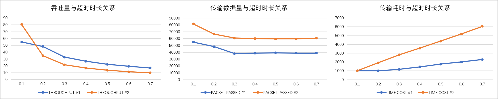

# Reliable Data Transport Protocol

## 设计策略

* **策略选择**

  * 采用Selective Repeat策略。

* **Packet设计**

  * 原则：只增加必要的信息进包头，选择满足条件的占用最少的数据类型。

  * 无条件在头部增加两字节存放校验码，因使用16位校验，选取unsigned int作为数据类型。
  * 尝试后发现测试用例的发包大概在几万这个数量级，因此新增的包的编号选择了unsigned int。
  * packet number在发送方为全局变量，因此保证了message的顺序，不需要添加message的信息。

  * Data Packet

    | Checksum | Packet number | Payload size | Payload  |
    | -------- | ------------- | ------------ | -------- |
    | 2 Bytes  | 2 Bytes       | 1 Byte       | The rest |

  * ACK Packet

    | Checksum | ACK number | Nothing  |
    | -------- | ---------- | -------- |
    | 2 Bytes  | 2 Bytes    | The rest |

## 实现策略

* **Sender**
  * packet number初始化为0，新包取当前packet number作为包号，并增加packet number。
  * 维护三个队列，分别对应包、包号、是否受到ACK，所有新包直接排进队列末尾，但活跃区仅为前WINDOWSIZE个元素。
  * 加入新进队的包处在活跃区，则发出这个包并（重新）开始计时。
  * 收到某个包的ACK时，如果这个包在队列中间，则仅标记其ACK为true；如果这个包在队首，则弹出队首开始连续的已收到ACK的包，然后依次发送新进入活跃区的包，并重新开始计时。**(滑动窗口)**
  * 一旦超时，若队列为空说明包发完了，直接返回；若队列不为空则依次发送活跃区内ACK状态为false的包，并重新开始计时。**(选择重传)**
  * 整个过程没有用到停止计时的功能。
* **Receiver**
  * next number初始化为0，表示当前等待的包的包号，收到该包后递增。
  * 维护两个队列，分别对应包、包号，符合条件的新收到的包会进入队列。
  * 收到包号小于next number的包，说明之前该包的ACK未送达，重发ACK后丢弃该包。
  * 收到包号在next number到next number + BUFFERSIZE - 1之间的包，检查队列内是否存在该包，存在则说明之前该包的ACK未送达，重发ACK后丢弃该包；不存在则放进队首，维护队列，发送ACK。
  * 收到包号超过next number + BUFFERSIZE - 1的包，说明滑窗出现了bug，但说不定还有救，直接丢弃并且不发ACK，万一滑窗又好了它会再次发送该包的。
  * 维护队列仅在新包进入队列时发生，放入新包后整理队列保持升序，若队首包号为next number，则将队首开始连续包号的包依次弹出传递给上层，并修改next number为最后一个弹出的后一位，如果弹空了则表示某一阶段的数据传输完毕。

## 参数选取

| TIMEOUT | BUFFER SIZE |
| ------- | ----------- |
| 0.3     | 16          |

首先用TA推荐的0.3作为超时限制，依次测试以2 ~ 16作为缓冲区大小的结果，得到如下趋势：

可见在超时限制不变的前提下缓冲区越大，吞吐量越高，传输耗时越低。但大容量缓冲区在实际情况下会增加对硬件的要求，因此适可而止地加到16就没再上探了。

然后以16作为缓冲区的大小，又依次测试了0.1 ~ 0.7作为超时限制的结果，得到如下趋势：

可见虽然超时时限越低吞吐量越高，传输耗时越短，但从传输数据与超时时长关系中会发现，过短的超时限制带来的性能提升背后是相同数据被反复重传的巨大开支，而大于0.3的超时限制不会再减少传输数据量，因此选择TA给出的0.3确实是比较合适的超时限制。**(详细测试数据参见test_data.xlsx)**

## 遇到的坑

* 一开始试图给message编号，再给message里的packet单独编号，后来发现这种设计没有必要，而且增加复杂度和开支，具体表现在需要事先告知接收方某条message的包数，而这条信息本身也可能崩掉。
* 因为有队列单独维护ACK状态和next number，在连续弹出的时候用队列的front()作为循环体的判断条件，忽略了队列可能在弹出过程中弹空导致下一次循环判断调用front()时出现无法预估的错误。